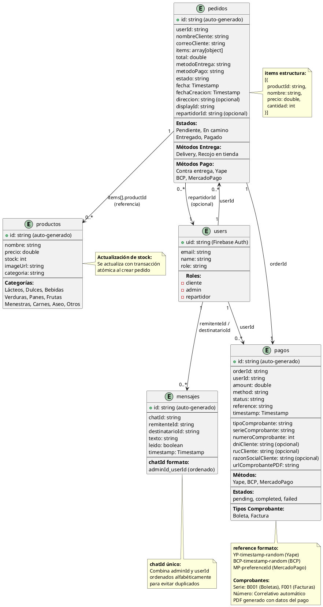

# 🗄️ Diagrama de Estructura de Base de Datos - Minik App

## 🎯 Descripción General

Este diagrama representa la **estructura de la base de datos NoSQL** del sistema **Minik App** usando **Firebase Firestore**. Muestra las **5 colecciones principales**, sus campos, tipos de datos y las **relaciones lógicas** entre ellas.

**Nota:** Firestore es una base de datos **NoSQL orientada a documentos**, por lo que no usa tablas relacionales ni claves foráneas tradicionales. Las relaciones se manejan mediante **referencias de IDs** entre documentos.

---

## 📊 Diagrama Lógico Entidad-Relación de Base de Datos (sobre Firestore)



---

## 📋 Explicación del Diagrama

### **🎯 ¿Qué es Firestore?**

**Firestore** es una base de datos **NoSQL orientada a documentos** de Firebase que:
- Organiza datos en **colecciones** (similares a tablas)
- Cada colección contiene **documentos** (similares a filas)
- Cada documento tiene **campos** con valores (similares a columnas)
- **No usa claves foráneas** tradicionales, sino referencias de IDs
- Soporta **consultas en tiempo real** con Streams

### **Diferencias con bases de datos relacionales:**

| Característica | SQL (Relacional) | Firestore (NoSQL) |
|----------------|------------------|-------------------|
| Estructura | Tablas con filas y columnas | Colecciones con documentos |
| Relaciones | Claves foráneas (FK) | Referencias de IDs |
| Esquema | Rígido (definido previamente) | Flexible (sin esquema fijo) |
| Consultas | SQL (JOIN, WHERE, etc.) | Queries con filtros |
| Transacciones | ACID completas | Transacciones limitadas (batch) |
| Escalabilidad | Vertical (más potencia) | Horizontal (más servidores) |

---

## 🗄️ Colecciones de Firestore

### **1. Colección: `productos`**

Almacena el catálogo de productos del minimarket.

**Campos:**
| Campo | Tipo | Descripción | Ejemplo |
|-------|------|-------------|---------|
| `id` | string | ID auto-generado por Firestore | `"abc123xyz"` |
| `nombre` | string | Nombre del producto | `"Leche Gloria"` |
| `precio` | double | Precio unitario en soles | `4.50` |
| `stock` | int | Cantidad disponible | `50` |
| `imageUrl` | string | URL de la imagen del producto | `"https://..."` |
| `categoria` | string | Categoría del producto | `"Lácteos"` |

**Categorías disponibles:**
- Lácteos
- Dulces
- Bebidas
- Verduras
- Panes
- Frutas
- Menestras
- Carnes
- Aseo
- Otros

**Ejemplo de documento:**
```json
{
  "id": "prod_001",
  "nombre": "Leche Gloria",
  "precio": 4.50,
  "stock": 50,
  "imageUrl": "https://example.com/leche.jpg",
  "categoria": "Lácteos"
}
```

---

### **2. Colección: `users`**

Almacena los usuarios del sistema con sus roles.

**Campos:**
| Campo | Tipo | Descripción | Ejemplo |
|-------|------|-------------|---------|
| `uid` | string | ID de Firebase Auth (PK) | `"user_abc123"` |
| `email` | string | Correo electrónico | `"cliente@example.com"` |
| `name` | string | Nombre completo | `"Juan Pérez"` |
| `role` | string | Rol del usuario | `"cliente"` |

**Roles disponibles:**
- `cliente` - Puede comprar productos
- `admin` - Gestiona el sistema
- `repartidor` - Entrega pedidos

**Ejemplo de documento:**
```json
{
  "uid": "user_001",
  "email": "juan@example.com",
  "name": "Juan Pérez",
  "role": "cliente"
}
```

---

### **3. Colección: `pedidos`**

Almacena los pedidos realizados por los clientes.

**Campos:**
| Campo | Tipo | Descripción | Ejemplo |
|-------|------|-------------|---------|
| `id` | string | ID auto-generado | `"order_001"` |
| `userId` | string | Referencia al usuario | `"user_001"` |
| `nombreCliente` | string | Nombre del cliente | `"Juan Pérez"` |
| `correoCliente` | string | Email del cliente | `"juan@example.com"` |
| `items` | array | Lista de productos comprados | `[{...}, {...}]` |
| `total` | double | Total a pagar | `25.50` |
| `metodoEntrega` | string | Delivery o Recojo en tienda | `"Delivery"` |
| `metodoPago` | string | Forma de pago | `"Yape"` |
| `estado` | string | Estado actual | `"Pendiente"` |
| `fecha` | Timestamp | Fecha del pedido | `2025-11-02 18:30:00` |
| `fechaCreacion` | Timestamp | Fecha de creación | `2025-11-02 18:30:00` |
| `direccion` | string | Dirección de entrega (opcional) | `"Av. Ejército 123"` |
| `displayId` | string | ID visible para el usuario | `"Pedido-12345"` |
| `repartidorId` | string | ID del repartidor asignado (opcional) | `"user_rep001"` |

**Estados del pedido:**
- `Pendiente` - Recién creado, esperando procesamiento
- `En camino` - Repartidor en ruta de entrega
- `Entregado` - Pedido entregado al cliente
- `Pagado` - Pago confirmado

**Estructura del campo `items`:**
```json
[
  {
    "productId": "prod_001",
    "nombre": "Leche Gloria",
    "precio": 4.50,
    "cantidad": 2
  },
  {
    "productId": "prod_002",
    "nombre": "Pan Francés",
    "precio": 0.30,
    "cantidad": 5
  }
]
```

**Ejemplo de documento completo:**
```json
{
  "id": "order_001",
  "userId": "user_001",
  "nombreCliente": "Juan Pérez",
  "correoCliente": "juan@example.com",
  "items": [
    {
      "productId": "prod_001",
      "nombre": "Leche Gloria",
      "precio": 4.50,
      "cantidad": 2
    }
  ],
  "total": 9.00,
  "metodoEntrega": "Delivery",
  "metodoPago": "Yape",
  "estado": "Pendiente",
  "fecha": "2025-11-02T18:30:00Z",
  "fechaCreacion": "2025-11-02T18:30:00Z",
  "direccion": "Av. Ejército 123",
  "displayId": "Pedido-12345",
  "repartidorId": null
}
```

---

### **4. Colección: `pagos`**

Almacena los pagos realizados por los clientes y la información de comprobantes de pago.

**Campos:**
| Campo | Tipo | Descripción | Ejemplo |
|-------|------|-------------|---------|
| `id` | string | ID auto-generado | `"pago_001"` |
| `orderId` | string | Referencia al pedido | `"order_001"` |
| `userId` | string | Referencia al usuario | `"user_001"` |
| `amount` | double | Monto pagado | `9.00` |
| `method` | string | Método de pago | `"Yape"` |
| `status` | string | Estado del pago | `"completed"` |
| `reference` | string | Referencia única del pago | `"YP-1730577000-1234"` |
| `timestamp` | Timestamp | Fecha y hora del pago | `2025-11-02 18:30:00` |
| `tipoComprobante` | string | Tipo de comprobante | `"Boleta"` |
| `serieComprobante` | string | Serie del comprobante | `"B001"` |
| `numeroComprobante` | int | Número correlativo | `12345` |
| `dniCliente` | string | DNI del cliente (solo boletas) | `"12345678"` |
| `rucCliente` | string | RUC del cliente (solo facturas) | `"20123456789"` |
| `razonSocialCliente` | string | Razón social (solo facturas) | `"Empresa SAC"` |
| `urlComprobantePDF` | string | URL del PDF del comprobante | `"https://..."` |

**Métodos de pago:**
- `Yape` - Pago con Yape (manual)
- `BCP` - Transferencia bancaria (manual)
- `MercadoPago` - Pago con tarjeta (API)
- `Contra entrega` - Pago al recibir

**Estados del pago:**
- `pending` - Esperando confirmación
- `completed` - Pago confirmado
- `failed` - Pago fallido

**Tipos de comprobante:**
- `Boleta` - Para clientes con DNI (personas naturales)
- `Factura` - Para clientes con RUC (empresas)

**Formato de referencia:**
- Yape: `YP-{timestamp}-{random}`
- BCP: `BCP-{timestamp}-{random}`
- MercadoPago: `MP-{preferenceId}`

**Formato de serie:**
- Boletas: `B001`, `B002`, etc.
- Facturas: `F001`, `F002`, etc.

**Ejemplo de documento (Boleta):**
```json
{
  "id": "pago_001",
  "orderId": "order_001",
  "userId": "user_001",
  "amount": 9.00,
  "method": "Yape",
  "status": "completed",
  "reference": "YP-1730577000-1234",
  "timestamp": "2025-11-02T18:35:00Z",
  "tipoComprobante": "Boleta",
  "serieComprobante": "B001",
  "numeroComprobante": 12345,
  "dniCliente": "12345678",
  "rucCliente": null,
  "razonSocialCliente": null,
  "urlComprobantePDF": "https://storage.googleapis.com/minik-app/comprobantes/B001-12345.pdf"
}
```

**Ejemplo de documento (Factura):**
```json
{
  "id": "pago_002",
  "orderId": "order_002",
  "userId": "user_002",
  "amount": 150.00,
  "method": "BCP",
  "status": "completed",
  "reference": "BCP-1730577100-5678",
  "timestamp": "2025-11-02T19:00:00Z",
  "tipoComprobante": "Factura",
  "serieComprobante": "F001",
  "numeroComprobante": 567,
  "dniCliente": null,
  "rucCliente": "20123456789",
  "razonSocialCliente": "Empresa Comercial SAC",
  "urlComprobantePDF": "https://storage.googleapis.com/minik-app/comprobantes/F001-567.pdf"
}
```

---

### **5. Colección: `mensajes`**

Almacena los mensajes del chat entre clientes y administrador.

**Campos:**
| Campo | Tipo | Descripción | Ejemplo |
|-------|------|-------------|---------|
| `id` | string | ID auto-generado | `"msg_001"` |
| `chatId` | string | ID único del chat | `"admin_user001"` |
| `remitenteId` | string | ID del que envía | `"user_001"` |
| `destinatarioId` | string | ID del que recibe | `"admin_001"` |
| `texto` | string | Contenido del mensaje | `"Hola, ¿tienen stock?"` |
| `leido` | boolean | Si fue leído o no | `false` |
| `timestamp` | Timestamp | Fecha y hora | `2025-11-02 18:40:00` |

**Formato del `chatId`:**
- Combina `adminId` y `userId` ordenados alfabéticamente
- Ejemplo: Si admin es `admin_001` y user es `user_002`
- chatId = `"admin_001_user_002"`
- Esto evita duplicar chats entre las mismas personas

**Ejemplo de documento:**
```json
{
  "id": "msg_001",
  "chatId": "admin_001_user_001",
  "remitenteId": "user_001",
  "destinatarioId": "admin_001",
  "texto": "Hola, ¿tienen stock de leche?",
  "leido": false,
  "timestamp": "2025-11-02T18:40:00Z"
}
```

---

## 🔗 Relaciones Lógicas entre Colecciones

### **1. users → pedidos (1:N)**
```
Un usuario puede tener muchos pedidos
pedidos.userId → users.uid
```

**Consulta en Firestore:**
```dart
FirebaseFirestore.instance
  .collection('pedidos')
  .where('userId', isEqualTo: currentUserId)
  .snapshots();
```

---

### **2. users → pagos (1:N)**
```
Un usuario puede tener muchos pagos
pagos.userId → users.uid
```

**Consulta en Firestore:**
```dart
FirebaseFirestore.instance
  .collection('pagos')
  .where('userId', isEqualTo: currentUserId)
  .snapshots();
```

---

### **3. pedidos → pagos (1:1)**
```
Un pedido tiene un pago asociado
pagos.orderId → pedidos.id
```

**Consulta en Firestore:**
```dart
FirebaseFirestore.instance
  .collection('pagos')
  .where('orderId', isEqualTo: orderId)
  .get();
```

---

### **4. pedidos → users (N:1) - Repartidor**
```
Un pedido puede tener un repartidor asignado
pedidos.repartidorId → users.uid (donde role = "repartidor")
```

**Consulta en Firestore:**
```dart
FirebaseFirestore.instance
  .collection('pedidos')
  .where('repartidorId', isEqualTo: repartidorId)
  .snapshots();
```

---

### **5. pedidos → productos (N:M) - Items**
```
Un pedido contiene múltiples productos
pedidos.items[].productId → productos.id
```

**Nota:** Esta relación se maneja mediante un **array de objetos** dentro del documento de pedido, no con documentos separados.

---

### **6. users → mensajes (1:N)**
```
Un usuario puede enviar/recibir muchos mensajes
mensajes.remitenteId → users.uid
mensajes.destinatarioId → users.uid
```

**Consulta en Firestore:**
```dart
FirebaseFirestore.instance
  .collection('mensajes')
  .where('chatId', isEqualTo: chatId)
  .orderBy('timestamp', descending: false)
  .snapshots();
```

---

## 🔄 Transacciones y Operaciones Críticas

### **1. Crear Pedido (Transacción Atómica)**

Cuando un cliente crea un pedido, se deben realizar **2 operaciones atómicas**:

```dart
// Firestore Batch Transaction
final batch = FirebaseFirestore.instance.batch();

// 1. Crear documento en 'pedidos'
batch.set(pedidoRef, pedidoData);

// 2. Actualizar stock de cada producto
for (var item in items) {
  final productoRef = FirebaseFirestore.instance
    .collection('productos')
    .doc(item.productId);
  
  batch.update(productoRef, {
    'stock': FieldValue.increment(-item.cantidad)
  });
}

// Ejecutar transacción
await batch.commit();
```

**¿Por qué es importante?**
- Si falla la creación del pedido, el stock NO se actualiza
- Si falla la actualización del stock, el pedido NO se crea
- Evita inconsistencias en la base de datos

---

### **2. Actualizar Estado de Pedido**

```dart
await FirebaseFirestore.instance
  .collection('pedidos')
  .doc(pedidoId)
  .update({'estado': 'En camino'});
```

**Notificación automática:**
- Firestore Stream detecta el cambio
- NotificationsController en la app recibe la actualización
- Cliente ve el nuevo estado en tiempo real

---

### **3. Asignar Repartidor**

```dart
await FirebaseFirestore.instance
  .collection('pedidos')
  .doc(pedidoId)
  .update({'repartidorId': repartidorId});
```

**Resultado:**
- El repartidor ve el pedido en su app
- Puede actualizar el estado a "En camino" o "Entregado"

---

## 📊 Índices Recomendados en Firestore

Para optimizar las consultas, Firestore necesita **índices compuestos**:

### **Índices necesarios:**

1. **pedidos**: `userId` + `fecha` (desc)
   - Para mostrar pedidos del usuario ordenados por fecha

2. **pedidos**: `estado` + `fecha` (desc)
   - Para filtrar pedidos por estado en el panel admin

3. **pedidos**: `repartidorId` + `fecha` (desc)
   - Para mostrar pedidos asignados al repartidor

4. **mensajes**: `chatId` + `timestamp` (asc)
   - Para mostrar mensajes del chat ordenados

5. **pagos**: `userId` + `timestamp` (desc)
   - Para mostrar pagos del usuario ordenados por fecha

**Firestore crea estos índices automáticamente** cuando haces la primera consulta que los necesita.

---

## 🔐 Reglas de Seguridad de Firestore

```javascript
rules_version = '2';
service cloud.firestore {
  match /databases/{database}/documents {
    
    // Función auxiliar para verificar autenticación
    function isSignedIn() {
      return request.auth != null;
    }
    
    // Función para verificar rol
    function hasRole(role) {
      return isSignedIn() && 
             get(/databases/$(database)/documents/users/$(request.auth.uid)).data.role == role;
    }
    
    // PRODUCTOS: Todos pueden leer, solo admin puede escribir
    match /productos/{productId} {
      allow read: if true;
      allow write: if hasRole('admin');
    }
    
    // USERS: Solo el propio usuario o admin puede leer/escribir
    match /users/{userId} {
      allow read: if isSignedIn() && (request.auth.uid == userId || hasRole('admin'));
      allow write: if isSignedIn() && (request.auth.uid == userId || hasRole('admin'));
    }
    
    // PEDIDOS: Usuario solo ve sus pedidos, admin ve todos
    match /pedidos/{pedidoId} {
      allow read: if isSignedIn() && 
                     (resource.data.userId == request.auth.uid || 
                      hasRole('admin') || 
                      hasRole('repartidor'));
      allow create: if isSignedIn();
      allow update: if hasRole('admin') || hasRole('repartidor');
      allow delete: if hasRole('admin');
    }
    
    // PAGOS: Usuario solo ve sus pagos, admin ve todos
    match /pagos/{pagoId} {
      allow read: if isSignedIn() && 
                     (resource.data.userId == request.auth.uid || hasRole('admin'));
      allow create: if isSignedIn();
      allow update: if hasRole('admin');
      allow delete: if hasRole('admin');
    }
    
    // MENSAJES: Solo participantes del chat pueden leer/escribir
    match /mensajes/{mensajeId} {
      allow read: if isSignedIn() && 
                     (resource.data.remitenteId == request.auth.uid || 
                      resource.data.destinatarioId == request.auth.uid);
      allow create: if isSignedIn();
      allow update: if isSignedIn() && 
                       (resource.data.remitenteId == request.auth.uid || 
                        resource.data.destinatarioId == request.auth.uid);
    }
  }
}
```

---

## 💡 Para tu Sustentación

### **Puntos clave a mencionar:**

1. **Base de datos NoSQL**: Firestore, orientada a documentos, sin esquema rígido
2. **5 colecciones principales**: productos, users, pedidos, pagos, mensajes
3. **Relaciones lógicas**: Mediante referencias de IDs, no claves foráneas
4. **Transacciones atómicas**: Batch para crear pedido + actualizar stock
5. **Sincronización en tiempo real**: Firestore Streams para notificaciones
6. **Seguridad**: Reglas de Firestore basadas en roles
7. **Escalabilidad**: Firestore escala horizontalmente automáticamente
8. **Comprobantes de pago**: Sistema de boletas y facturas con datos de SUNAT

### **Cómo explicarlo:**

> "La base de datos usa Firebase Firestore, que es NoSQL orientada a documentos. Tenemos 5 colecciones principales: productos para el catálogo, users para los usuarios con roles, pedidos para las compras, pagos para los métodos de pago, y mensajes para el chat. Las relaciones entre colecciones se manejan mediante referencias de IDs, no claves foráneas como en SQL. Por ejemplo, un pedido tiene un userId que referencia al usuario que lo creó. Usamos transacciones atómicas con Firestore Batch para operaciones críticas como crear un pedido y actualizar el stock simultáneamente, garantizando consistencia. Firestore también nos permite sincronización en tiempo real con Streams, por eso las notificaciones funcionan instantáneamente cuando la app está abierta."

### **Si te preguntan por qué NoSQL y no SQL:**

> "Elegimos Firestore (NoSQL) porque ofrece sincronización en tiempo real out-of-the-box, escala automáticamente sin configuración, y se integra perfectamente con Flutter y React mediante Firebase SDK. Para un e-commerce pequeño como un minimarket, la flexibilidad de NoSQL es ideal porque podemos agregar campos nuevos sin migrar esquemas. Además, Firebase maneja la infraestructura, autenticación y hosting, reduciendo costos y complejidad. Si usáramos SQL, necesitaríamos un servidor backend adicional, configurar WebSockets para tiempo real, y gestionar la escalabilidad manualmente."

---

## 📄 Gestión de Comprobantes de Pago y SUNAT

### **🎯 Contexto Legal en Perú**

En Perú, **todo negocio que vende productos debe emitir comprobantes de pago** según las normas de **SUNAT** (Superintendencia Nacional de Aduanas y de Administración Tributaria).

**Tipos de comprobantes:**
- **Boleta de Venta**: Para clientes con DNI (personas naturales)
- **Factura**: Para clientes con RUC (empresas que necesitan sustentar gastos)

---

### **🛠️ Implementación en Minik App**

#### **Fase 1: Generación de Comprobantes (Actual)**

Para pequeños emprendimientos, el proceso es:

1. **Al completar un pago**, el sistema genera automáticamente:
   - Tipo de comprobante (Boleta o Factura)
   - Serie (B001 para boletas, F001 para facturas)
   - Número correlativo (auto-incrementado)
   - Datos del cliente (DNI o RUC)
   - Detalle de productos y montos

2. **El sistema genera un PDF** con formato válido que incluye:
   - Logo y datos de Minik App (RUC, dirección)
   - Datos del cliente
   - Detalle de productos con precios
   - Subtotal, IGV (18%) y Total
   - Fecha y hora de emisión

3. **El cliente puede descargar el PDF** desde la app

4. **El administrador registra manualmente** las ventas en el sistema de SUNAT (mensual o semanal)

**Ventajas:**
- ✅ Cumple con la obligación legal de emitir comprobantes
- ✅ No requiere integración compleja ni costos adicionales
- ✅ Ideal para negocios pequeños que están iniciando
- ✅ El PDF sirve como respaldo para el cliente

---

#### **Fase 2: Integración con SUNAT (Futuro - Cuando el negocio crezca)**

Cuando el volumen de ventas aumente, se puede integrar con un **PSE (Proveedor de Servicios Electrónicos)**:

**Opciones de PSE en Perú:**
- **Nubefact** (https://nubefact.com)
- **FactuSol** (gratuito de SUNAT)
- **Sunat API** (integración directa)
- **Facturador.pe**

**Proceso con PSE:**
1. Al completar el pago, el sistema envía los datos al PSE
2. El PSE genera el comprobante electrónico
3. El PSE envía el comprobante a SUNAT
4. SUNAT devuelve un **hash de validación** (código QR)
5. El sistema guarda el hash en el campo `hashSunat` (nuevo campo a agregar)
6. El cliente recibe el PDF con el código QR de validación

**Campos adicionales necesarios para integración futura:**
```
pagos {
  ...
  hashSunat: string (código de validación de SUNAT)
  estadoSunat: string (Aceptado, Rechazado, Pendiente)
  fechaEnvioSunat: Timestamp
}
```

---

### **📊 Estructura de Datos para Comprobantes**

**Campos actuales en la colección `pagos`:**

| Campo | Tipo | Uso | Ejemplo |
|-------|------|-----|---------|
| `tipoComprobante` | string | Boleta o Factura | `"Boleta"` |
| `serieComprobante` | string | Serie del comprobante | `"B001"` |
| `numeroComprobante` | int | Número correlativo | `12345` |
| `dniCliente` | string | DNI (solo boletas) | `"12345678"` |
| `rucCliente` | string | RUC (solo facturas) | `"20123456789"` |
| `razonSocialCliente` | string | Razón social (solo facturas) | `"Empresa SAC"` |
| `urlComprobantePDF` | string | URL del PDF generado | `"https://..."` |

---

### **💡 Para tu Sustentación**

#### **Si te preguntan: "¿Cómo manejan la facturación con SUNAT?"**

**Respuesta:**

> "El sistema genera comprobantes de pago (boletas o facturas) con formato válido según las normas de SUNAT. En la colección `pagos` almacenamos toda la información necesaria: tipo de comprobante, serie, número correlativo, datos del cliente (DNI o RUC), y generamos un PDF que el cliente puede descargar.
>
> Para un emprendimiento pequeño como Minik App, el proceso es: el sistema genera el comprobante en PDF automáticamente, el cliente lo descarga, y el administrador registra las ventas manualmente en el sistema de SUNAT de forma mensual o semanal. Esto es lo que hacen la mayoría de pequeños negocios en Perú.
>
> En el futuro, cuando el volumen de ventas crezca, podemos integrar con un PSE (Proveedor de Servicios Electrónicos) como Nubefact o la API de SUNAT para enviar los comprobantes electrónicamente en tiempo real y obtener el hash de validación. Para esto, solo necesitaríamos agregar dos campos más: `hashSunat` y `estadoSunat`."

#### **Si te preguntan: "¿Por qué no tienen integración directa con SUNAT?"**

**Respuesta:**

> "La integración directa con SUNAT requiere certificados digitales, configuración de APIs complejas, y tiene costos asociados. Para un emprendimiento pequeño que está iniciando, la SUNAT permite el registro manual de comprobantes, que es lo que implementamos. El sistema genera PDFs con formato válido que cumplen con los requisitos legales, y el administrador los registra periódicamente en el portal de SUNAT. Esto es más económico y suficiente para el volumen inicial de ventas. Cuando el negocio crezca, la migración a facturación electrónica es directa porque ya tenemos toda la estructura de datos necesaria."

#### **Si te preguntan: "¿Qué datos de SUNAT necesitan?"**

**Respuesta:**

> "Necesitamos el RUC de Minik App como emisor, que debe estar registrado en SUNAT. Para los comprobantes, usamos series autorizadas: B001 para boletas y F001 para facturas. Cada comprobante tiene un número correlativo que se auto-incrementa. Para boletas solicitamos el DNI del cliente, y para facturas solicitamos RUC y razón social. El PDF incluye todos estos datos más el detalle de productos, subtotal, IGV (18%) y total. Esto cumple con los requisitos mínimos de SUNAT para comprobantes de pago."

---

**Generado para:** Minik App - Sistema de E-commerce  
**Fecha:** Noviembre 2025  
**Tecnología:** Firebase Firestore (NoSQL)
