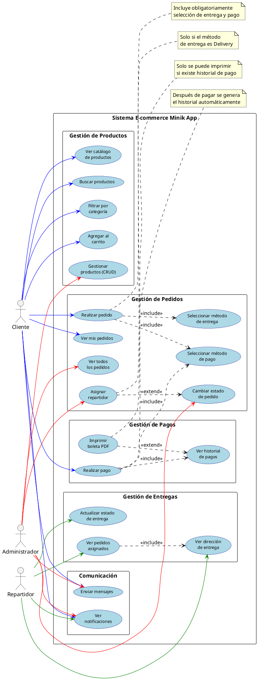

# 📐 Diagrama de Casos de Uso - Minik App

## 🎯 Descripción General

Este diagrama representa las **funcionalidades principales** del sistema **Minik App** desde la perspectiva de los tres tipos de usuarios: **Cliente**, **Administrador** y **Repartidor**.

---

## 📊 Diagrama de Casos de Uso (PlantUML)



---

## 📋 Explicación del Diagrama

### **🎯 ¿Qué es un Diagrama de Casos de Uso?**

Es un diagrama que muestra:
- **Actores** (usuarios del sistema)
- **Casos de uso** (funcionalidades principales que puede hacer cada actor)
- **Relaciones** entre ellos

**NO es necesario poner TODAS las funcionalidades**, solo las **más importantes y representativas** del sistema.

---

### **📊 Estructura de este Diagrama**

El diagrama está organizado **horizontalmente** mostrando:

1. **3 Actores** (izquierda): Cliente, Administrador, Repartidor
2. **20 Casos de Uso** (centro): Organizados en 5 módulos funcionales
3. **Relaciones con colores**:
   - 🔵 **Azul**: Funcionalidades del Cliente
   - 🔴 **Rojo**: Funcionalidades del Administrador
   - 🟢 **Verde**: Funcionalidades del Repartidor
4. **Relaciones Include/Extend**: Dependencias entre casos de uso

---

### **👥 Actores del Sistema**

| Actor | Rol | Funcionalidades Principales |
|-------|-----|---------------------------|
| **Cliente** | Compra productos | Ver productos, Carrito, Pedidos, Pagos |
| **Administrador** | Gestiona el sistema | Productos, Pedidos, Repartidores, Reportes |
| **Repartidor** | Entrega pedidos | Ver asignados, Actualizar estado |

---

## 🔄 Casos de Uso del Sistema (20 principales)

### **📦 Módulo 1: Gestión de Productos (5 casos de uso)**

| # | Caso de Uso | Actor | Descripción |
|---|-------------|-------|-------------|
| UC1 | **Ver catálogo de productos** | Cliente | Visualiza todos los productos disponibles con stock en tiempo real |
| UC2 | **Buscar productos** | Cliente | Busca productos por nombre usando barra de búsqueda |
| UC3 | **Filtrar por categoría** | Cliente | Filtra productos por categorías (Lácteos, Dulces, Bebidas, etc.) |
| UC4 | **Agregar al carrito** | Cliente | Agrega productos al carrito de compras |
| UC5 | **Gestionar productos (CRUD)** | Admin | Crear, editar, eliminar productos y actualizar stock |

---

### **📋 Módulo 2: Gestión de Pedidos (7 casos de uso)**

| # | Caso de Uso | Actor | Descripción |
|---|-------------|-------|-------------|
| UC6 | **Realizar pedido** | Cliente | Confirma la compra (incluye selección de entrega y pago) |
| UC7 | **Seleccionar método de entrega** | - | Elige Delivery o Recojo en tienda (incluido en UC6) |
| UC8 | **Seleccionar método de pago** | - | Elige: Contra entrega, Yape, BCP, MercadoPago (incluido en UC6 y UC13) |
| UC9 | **Ver mis pedidos** | Cliente | Visualiza historial de pedidos con estado y detalles |
| UC10 | **Ver todos los pedidos** | Admin | Visualiza todos los pedidos del sistema con filtros |
| UC11 | **Cambiar estado de pedido** | Admin | Actualiza estado: Pendiente → En camino → Entregado |
| UC12 | **Asignar repartidor** | Admin | Asigna repartidor a pedidos con método Delivery (extiende UC11) |

---

### **💳 Módulo 3: Gestión de Pagos (3 casos de uso)**

| # | Caso de Uso | Actor | Descripción |
|---|-------------|-------|-------------|
| UC13 | **Realizar pago** | Cliente | Procesa el pago según método elegido (Yape, BCP, MercadoPago) |
| UC14 | **Ver historial de pagos** | Cliente | Visualiza todos los pagos realizados con filtro por fecha |
| UC15 | **Imprimir boleta PDF** | Cliente | Genera y descarga PDF de la boleta de compra |

---

### **🚚 Módulo 4: Gestión de Entregas (3 casos de uso)**

| # | Caso de Uso | Actor | Descripción |
|---|-------------|-------|-------------|
| UC16 | **Ver pedidos asignados** | Repartidor | Visualiza pedidos que le fueron asignados (incluye dirección) |
| UC17 | **Ver dirección de entrega** | Repartidor | Visualiza la dirección completa del pedido (incluido en UC16) |
| UC18 | **Actualizar estado de entrega** | Repartidor | Cambia estado a "En camino" o "Entregado" |

---

### **💬 Módulo 5: Comunicación (2 casos de uso)**

| # | Caso de Uso | Actor | Descripción |
|---|-------------|-------|-------------|
| UC19 | **Enviar mensajes** | Cliente, Admin | Chat directo entre cliente y administrador |
| UC20 | **Ver notificaciones** | Todos | Recibe alertas de pedidos, mensajes y cambios de estado |

---

## 🔗 Relaciones en el Diagrama

### **1. Asociación (—)** - Actor usa Caso de Uso

Línea **sólida** que conecta un actor con un caso de uso que puede realizar.

**Ejemplos:**
- `Cliente --> Ver catálogo de productos` ✅
- `Cliente --> Realizar pedido` ✅
- `Administrador --> Gestionar productos` ✅
- `Repartidor --> Ver pedidos asignados` ✅

---

### **2. Include (<<include>>)** - Dependencia Obligatoria

Línea **punteada** que indica que un caso de uso **SIEMPRE incluye** otro para completarse.

**¿Cuándo usar?** Cuando el caso de uso base NO puede ejecutarse sin el incluido.

| Caso de Uso Base | Incluye | ¿Por qué? |
|-----------------|---------|-----------|
| **Realizar pedido** (UC6) | Seleccionar método de entrega (UC7) | Para realizar un pedido, SIEMPRE debe elegir cómo recibirlo |
| **Realizar pedido** (UC6) | Seleccionar método de pago (UC8) | Para realizar un pedido, SIEMPRE debe elegir cómo pagar |
| **Realizar pago** (UC13) | Seleccionar método de pago (UC8) | Para pagar, SIEMPRE debe tener un método seleccionado |
| **Realizar pago** (UC13) | Ver historial de pagos (UC14) | Al pagar, SIEMPRE se genera el historial automáticamente |
| **Ver pedidos asignados** (UC16) | Ver dirección de entrega (UC17) | Para ver pedidos asignados, SIEMPRE debe ver la dirección |

**Notación:** `UC6 ..> UC7 : <<include>>`

**💡 Clave:** Los casos de uso UC7 y UC8 son **internos** (no aparecen como funcionalidades directas del actor), por eso se incluyen.

---

### **3. Extend (<<extend>>)** - Extensión Opcional

Línea **punteada** que indica que un caso de uso **PUEDE extender** otro bajo ciertas condiciones.

**¿Cuándo usar?** Cuando el caso de uso base PUEDE completarse sin el extendido.

| Caso de Uso Base | Extiende | ¿Cuándo? |
|-----------------|----------|----------|
| **Cambiar estado de pedido** (UC11) | Asignar repartidor (UC12) | Solo si el método de entrega es "Delivery" |
| **Ver historial de pagos** (UC14) | Imprimir boleta PDF (UC15) | Solo si el cliente desea descargar la boleta |

**Notación:** `UC12 ..> UC11 : <<extend>>` y `UC15 ..> UC14 : <<extend>>`

**💡 Clave:** 
- "Asignar repartidor" es **opcional** porque solo aplica a pedidos con Delivery, no a "Recojo en tienda".
- "Imprimir boleta PDF" es **opcional** porque el cliente puede ver el historial sin necesidad de imprimir.

---

### **📊 Resumen de Relaciones:**

```
Asociación (—)       : Actor PUEDE HACER el caso de uso
Include (<<include>>): Caso de uso SIEMPRE NECESITA otro (dependencia obligatoria)
Extend (<<extend>>)  : Caso de uso OPCIONALMENTE extiende otro (funcionalidad adicional)
```

**✅ Este diseño NO parece secuencia porque:**
- Los casos de uso están distribuidos **horizontalmente** en 4 filas
- Las relaciones `<<include>>` solo conectan casos de uso **internos** (no visibles para actores)
- La relación `<<extend>>` muestra una funcionalidad **opcional**, no un flujo obligatorio

---

## 🎯 Flujo del E-commerce (Proceso Completo)

```
┌─────────────────────────────────────────────────────────────────┐
│                    FLUJO PRINCIPAL DEL SISTEMA                   │
└─────────────────────────────────────────────────────────────────┘

1. 🛍️ CLIENTE → Ver productos → Filtrar por categoría
                ↓
2. 🛒 CLIENTE → Agregar al carrito → Gestionar cantidades
                ↓
3. 📦 CLIENTE → Realizar pedido → Seleccionar entrega y pago
                ↓
4. ⚙️ SISTEMA → Crear pedido → Actualizar stock en tiempo real
                ↓
5. 💳 CLIENTE → Pagar pedido → Generar comprobante PDF
                ↓
6. 👨‍💼 ADMIN → Ver pedido → Cambiar estado → Asignar repartidor
                ↓
7. 🚚 REPARTIDOR → Ver pedido asignado → Actualizar a "En camino"
                ↓
8. 📍 REPARTIDOR → Ver dirección → Entregar → Actualizar a "Entregado"
                ↓
9. 🔔 CLIENTE → Recibir notificación → Ver estado actualizado
```

---

## 📝 Resumen del Diagrama

### **Cantidad de elementos:**

| Elemento | Cantidad | Detalle |
|----------|----------|--------------|
| **Actores** | 3 | Cliente, Administrador, Repartidor |
| **Casos de Uso Totales** | 20 | Organizados en 5 módulos funcionales |
| **Módulos** | 5 | Productos, Pedidos, Pagos, Entregas, Comunicación |

### **Distribución por Actor:**
| Actor | Casos de Uso | Color |
|-------|--------------|-------|
| **Cliente** | 9 | 🔵 Azul |
| **Administrador** | 6 | 🔴 Rojo |
| **Repartidor** | 4 | 🟢 Verde |
| **Compartidos** | 1 (UC20) | Todos los actores |

### **Organización por Módulos:**
1. **Gestión de Productos** (5 casos de uso): UC1-UC5
2. **Gestión de Pedidos** (7 casos de uso): UC6-UC12
3. **Gestión de Pagos** (3 casos de uso): UC13-UC15
4. **Gestión de Entregas** (3 casos de uso): UC16-UC18
5. **Comunicación** (2 casos de uso): UC19-UC20

### **Relaciones:**
- **20 relaciones de Asociación** con colores por actor
- **5 relaciones Include** (UC6→UC7, UC6→UC8, UC13→UC8, UC13→UC14, UC16→UC17)
- **2 relaciones Extend** (UC12→UC11, UC15→UC14)

### **✅ Este diagrama es CORRECTO porque:**

1. ✅ **Actores fuera del sistema** - Los 3 actores están a la izquierda, fuera del rectángulo
2. ✅ **Casos de uso dentro del sistema** - Organizados en 5 packages (módulos)
3. ✅ **Organización horizontal** - Los packages se distribuyen de izquierda a derecha
4. ✅ **Colores diferenciados** - Azul (Cliente), Rojo (Admin), Verde (Repartidor)
5. ✅ **Include bien usado** - Solo para casos de uso internos obligatorios
6. ✅ **Extend bien usado** - "Asignar repartidor" es opcional (solo para Delivery)
7. ✅ **No parece secuencial** - Los módulos están agrupados funcionalmente, no temporalmente
8. ✅ **Casos de alto nivel** - Solo funcionalidades principales del sistema

---

## ✅ Características del Diagrama

- ✅ **Horizontal**: Módulos distribuidos de izquierda a derecha con `left to right direction`
- ✅ **Modular**: 5 packages que agrupan funcionalidades relacionadas
- ✅ **Visual**: Colores para diferenciar qué actor usa cada funcionalidad
- ✅ **Completo**: Cubre todas las funcionalidades principales del e-commerce
- ✅ **Include/Extend correctos**: Usados solo donde es necesario
- ✅ **Profesional**: Cumple con el estándar UML de casos de uso
- ✅ **Limpio**: Espaciado optimizado con `ranksep` y `nodesep`
- ✅ **Documentado**: Incluye notas explicativas para casos complejos

---

## 💡 Para tu Sustentación

### **Puntos clave a mencionar:**

1. **3 Actores principales** con roles bien definidos en el e-commerce
2. **20 Casos de uso** organizados en 5 módulos funcionales
3. **Diseño horizontal** con packages que agrupan funcionalidades relacionadas
4. **Colores diferenciados**: Azul (Cliente), Rojo (Admin), Verde (Repartidor)
5. **5 relaciones Include** para casos de uso internos obligatorios y secuencia lógica de pagos
6. **2 relaciones Extend** para funcionalidades opcionales (asignar repartidor e imprimir boleta)
7. **Cobertura completa** del flujo: Productos → Pedidos → Pagos → Entregas
8. **Problema que resuelve**: Reduce tiempo de compra en 83-92% vs método tradicional

### **Cómo explicarlo:**

> "El diagrama de casos de uso muestra las 20 funcionalidades principales del sistema Minik App organizadas horizontalmente en 5 módulos. Tenemos 3 actores: Cliente (9 funcionalidades en azul), Administrador (6 funcionalidades en rojo) y Repartidor (4 funcionalidades en verde). Los módulos son: Gestión de Productos, Gestión de Pedidos, Gestión de Pagos, Gestión de Entregas y Comunicación. Usamos colores para identificar rápidamente qué actor realiza cada funcionalidad. Las relaciones Include muestran casos de uso internos obligatorios y secuencias lógicas: por ejemplo, 'Realizar pedido' incluye selección de entrega y pago, y 'Realizar pago' incluye automáticamente generar el historial de pagos. Las relaciones Extend muestran funcionalidades opcionales: 'Asignar repartidor' solo para Delivery e 'Imprimir boleta PDF' solo si el cliente lo desea."

### **Si te preguntan por qué SÍ hay Include/Extend:**

> "Usé Include para casos de uso internos obligatorios y secuencias lógicas. Por ejemplo, 'Realizar pedido' incluye seleccionar método de entrega y pago porque son pasos internos obligatorios. En el módulo de pagos, 'Realizar pago' incluye automáticamente 'Ver historial de pagos' porque sin pago no puede existir historial, es una secuencia lógica obligatoria. Usé Extend para funcionalidades opcionales: 'Asignar repartidor' solo aplica cuando el método de entrega es Delivery, e 'Imprimir boleta PDF' solo si el cliente desea descargar la boleta, ya que puede ver el historial sin imprimirlo."

### **Si te preguntan por qué NO parece secuencia:**

> "No parece secuencia porque los casos de uso están agrupados en módulos funcionales (Productos, Pedidos, Pagos, Entregas, Comunicación), no en un flujo paso a paso. Los actores pueden ejecutar los casos de uso en cualquier orden: un cliente puede ver productos, luego ver sus pedidos, luego agregar al carrito, etc. No hay un orden obligatorio. Las relaciones Include y Extend solo muestran dependencias lógicas entre casos de uso específicos, no un flujo temporal completo del sistema."

### **Si te preguntan por los colores:**

> "Usé colores para facilitar la lectura del diagrama: azul para Cliente, rojo para Administrador y verde para Repartidor. Esto permite identificar rápidamente qué actor realiza cada funcionalidad sin tener que seguir todas las líneas de asociación. Es una buena práctica de UML para diagramas con muchas relaciones."

---

**Generado para:** Minik App - Sistema de E-commerce  
**Fecha:** Octubre 2025  
**Tecnologías:** Flutter (App Móvil) + React (Panel Web) + Firebase (Backend)
