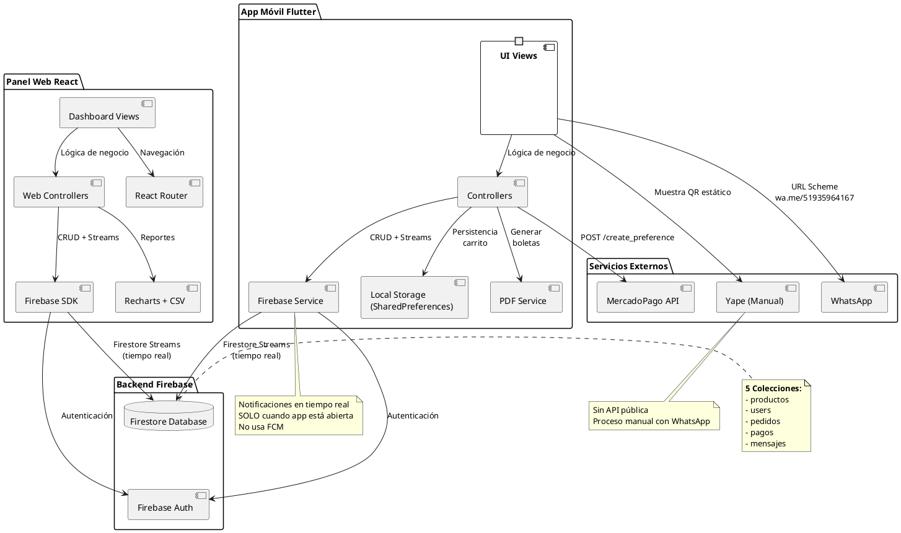

# 🏗️ Diagrama de Componentes - Minik App

## 🎯 Descripción General

Este diagrama representa la **arquitectura de componentes** del sistema **Minik App**, mostrando cómo se organizan y comunican los diferentes módulos del sistema: **App Móvil Flutter**, **Panel Web React** y **Backend Firebase**.

---

## 📊 Diagrama de Componentes (PlantUML)



---

## 📋 Explicación del Diagrama

### **🎯 ¿Qué es un Diagrama de Componentes?**

Es un diagrama que muestra:
- **Componentes** (módulos o partes del sistema)
- **Interfaces** (cómo se comunican entre sí)
- **Dependencias** (qué componente necesita a otro)

Representa la **arquitectura física** del sistema, mostrando cómo está organizado el código.

---

## 🏗️ Componentes del Sistema

### **1. App Móvil Flutter**

Aplicación móvil multiplataforma para clientes y repartidores.

**Funcionalidades principales:**
- Ver catálogo de productos con búsqueda y filtros
- Carrito de compras con persistencia local (SharedPreferences)
- Realizar pedidos con selección de entrega y pago
- Ver historial de pedidos y pagos
- Chat en tiempo real con administrador
- Notificaciones en tiempo real (solo cuando app está abierta)
- Vista especial para repartidores con pedidos asignados
- Generación de boletas PDF

**Tecnologías:**
- Flutter 3.9.2
- Provider + GetX (gestión de estado)
- Firebase SDK (Firestore + Auth)
- SharedPreferences (persistencia local)
- PDF Service (generación de boletas)

---

### **2. Panel Web React**

Panel administrativo web para gestionar el sistema.

**Funcionalidades principales:**
- Dashboard con métricas y estadísticas
- Gestión de productos (CRUD completo)
- Gestión de pedidos (ver, cambiar estado, asignar repartidores)
- Chat con clientes
- Exportación de reportes a CSV
- Gráficos de ventas con Recharts

**Tecnologías:**
- React 19.1.1
- React Router (navegación)
- Firebase SDK (Firestore + Auth)
- Recharts (gráficos)
- react-csv (exportación)

---

### **3. Firebase (Backend)**

Backend centralizado que maneja toda la lógica de datos y autenticación.

**Firestore Database (5 colecciones):**
- `productos` - Catálogo con stock
- `users` - Usuarios con roles
- `pedidos` - Pedidos con items y estado
- `pagos` - Pagos con método y referencia
- `mensajes` - Chat cliente-admin

**Firebase Auth:**
- Autenticación con email/password
- Roles: cliente, admin, repartidor

**Sincronización en Tiempo Real:**
- Firestore Streams (NO usa FCM)
- Notificaciones solo cuando app está abierta
- Cambios se reflejan instantáneamente en ambos frontends

---

### **4. Servicios Externos**

#### **MercadoPago API**
- Integración para pagos con tarjeta
- Servidor ngrok para sandbox
- Endpoint: `POST /create_preference`

#### **WhatsApp**
- Envío manual de comprobantes
- URL Scheme: `https://wa.me/51935964167`

#### **Yape (Manual)**
- Sin API pública
- QR estático mostrado en la app
- Proceso manual: Cliente yapea → Envía comprobante por WhatsApp → Admin verifica

---

## 🔄 Flujos de Comunicación Principales

### **Flujo 1: Cliente realiza un pedido**

```
App Móvil → Firebase (crear pedido + actualizar stock)
          → Firebase (crear pago)
          → MercadoPago API (si paga con tarjeta)
          → Firestore Streams notifica a Panel Web
```

**Detalles:**
1. Cliente confirma pedido desde el carrito
2. Se crea documento en `pedidos` y se actualiza stock en `productos` (transacción atómica)
3. Se crea documento en `pagos` con método seleccionado
4. Si es MercadoPago, se llama a la API y se abre URL de pago
5. Panel Web recibe notificación en tiempo real del nuevo pedido

---

### **Flujo 2: Admin gestiona pedidos**

```
Panel Web → Firebase (actualizar estado de pedido)
          → Firestore Streams notifica a App Móvil (si está abierta)
```

**Detalles:**
1. Admin cambia estado del pedido (Pendiente → En camino → Entregado)
2. Admin asigna repartidor (si es Delivery)
3. Firestore actualiza el documento
4. **Si la app móvil está abierta:** Cliente recibe notificación instantánea
5. **Si la app móvil está cerrada:** Cliente ve el cambio al abrir la app

---

### **Flujo 3: Sincronización en Tiempo Real**

```
Firestore → Firestore Streams → App Móvil (si está abierta)
                              → Panel Web (siempre)
```

**Características:**
- Cambios en `pedidos`, `productos`, `mensajes` se reflejan instantáneamente
- No usa Firebase Cloud Messaging (FCM)
- Notificaciones solo cuando la app está abierta
- Ambos frontends escuchan los mismos Streams

---

## 🔗 Dependencias entre Componentes

### **App Móvil Flutter depende de:**
- ✅ Firebase (Firestore, Auth) - **NO usa Cloud Messaging**
- ✅ SharedPreferences (persistencia local del carrito)
- ✅ Provider y GetX (gestión de estado)
- ✅ MercadoPago API (pagos con tarjeta)
- ✅ WhatsApp (envío manual de comprobantes)
- ✅ Firestore Streams (notificaciones en tiempo real cuando app está abierta)

### **Panel Web React depende de:**
- ✅ Firebase SDK (Firestore, Auth)
- ✅ React Router (navegación)
- ✅ Recharts (gráficos de ventas)
- ✅ react-csv (exportación de reportes)

### **Backend Firebase depende de:**
- ✅ Google Cloud Platform (infraestructura)
- ✅ Firestore (base de datos NoSQL)
- ✅ Firebase Auth (autenticación con JWT)

### **Servicios Externos son independientes:**
- ⚠️ MercadoPago API (servidor ngrok puede caer)
- ⚠️ WhatsApp (depende de conexión a internet)

### **Recursos Manuales (sin dependencias):**
- 📱 Yape (QR estático, sin API)
- 📱 BCP (número de cuenta, sin API)

---

## 📦 Tecnologías por Componente

### **App Móvil Flutter**
```yaml
dependencies:
  flutter: 3.9.2
  firebase_core: ^2.24.2
  firebase_auth: ^4.16.0
  cloud_firestore: ^4.14.0
  provider: ^6.1.1
  get: ^4.6.6
  shared_preferences: ^2.2.2
  pdf: ^3.10.7
  printing: ^5.12.0
  url_launcher: ^6.2.3
  qr_flutter: ^4.1.0
```

### **Panel Web React**
```json
{
  "react": "19.1.1",
  "firebase": "12.2.1",
  "react-router-dom": "7.9.1",
  "react-csv": "2.2.2",
  "recharts": "2.15.1",
  "react-toastify": "11.0.3",
  "mercadopago": "2.9.0"
}
```

### **Backend Firebase**
- Firestore (NoSQL Database)
- Firebase Authentication
- Cloud Messaging
- Firebase Hosting (para panel web)

---

## 🎯 Patrones de Arquitectura Utilizados

### **1. MVC (Model-View-Controller)**
- **Model**: Modelos de datos (Product, Order, Payment, User)
- **View**: UI Views (Flutter) y Dashboard (React)
- **Controller**: Controllers que manejan la lógica de negocio

### **2. Repository Pattern**
- Controllers acceden a Firebase a través de Services
- Abstracción de la fuente de datos

### **3. Observer Pattern**
- Firestore Streams notifican cambios en tiempo real
- Provider notifica cambios de estado a las vistas

### **4. Singleton Pattern**
- Firebase Service es una instancia única
- CartController mantiene un solo carrito por usuario

---

## 🔐 Seguridad y Validaciones

### **Autenticación**
```
Usuario → Firebase Auth → Token JWT → Validación en cada request
```

### **Autorización**
```
Usuario → Firestore Security Rules → Verifica role → Permite/Deniega acceso
```

### **Transacciones Atómicas**
```
OrderController → Firestore Batch → Crea pedido + Actualiza stock → Commit
```

---

## 📊 Resumen del Diagrama

### **Componentes Principales:**
| Componente | Tipo | Tecnología | Responsabilidad |
|------------|------|------------|-----------------|
| **App Móvil** | Frontend | Flutter | Interfaz para Cliente y Repartidor |
| **Panel Web** | Frontend | React | Interfaz para Administrador |
| **Backend** | Backend | Firebase | Base de datos, autenticación, mensajería |
| **Servicios Externos** | API | MercadoPago, WhatsApp | Pagos y comunicación |

### **Comunicación:**
- **App ↔ Firebase**: Firestore SDK (tiempo real)
- **Web ↔ Firebase**: Firebase SDK (tiempo real)
- **App ↔ MercadoPago**: HTTP POST
- **App ↔ WhatsApp**: URL Scheme

### **Persistencia:**
- **Remota**: Firestore (productos, pedidos, pagos, mensajes)
- **Local**: SharedPreferences (carrito)

---

## 💡 Para tu Sustentación

### **Puntos clave a mencionar:**

1. **Arquitectura de 3 capas**: Presentación (UI), Lógica (Controllers), Datos (Firebase)
2. **2 Frontends**: App móvil (Flutter) y Panel web (React)
3. **Backend centralizado**: Firebase con Firestore para sincronización en tiempo real
4. **Servicios externos**: MercadoPago API para pagos con tarjeta
5. **Recursos manuales**: Yape (QR estático, sin API), WhatsApp para comprobantes
6. **Patrones de diseño**: MVC, Repository, Observer, Singleton
7. **Notificaciones en tiempo real**: Firestore Streams (solo cuando app está abierta, NO usa FCM)
8. **Persistencia local**: SharedPreferences para el carrito (evita pérdida de datos)

### **Cómo explicarlo:**

> "El diagrama de componentes muestra la arquitectura del sistema Minik App con 4 componentes principales: App Móvil Flutter, Panel Web React, Backend Firebase y Servicios Externos. La app móvil y el panel web se comunican con Firebase usando Firestore Streams para sincronización en tiempo real. Firebase maneja 5 colecciones: productos, users, pedidos, pagos y mensajes. Para pagos, integramos MercadoPago API para tarjetas, mientras que Yape es manual: mostramos un QR estático, el cliente yapea y envía el comprobante por WhatsApp. Las notificaciones funcionan en tiempo real con Firestore Streams, pero solo cuando la app está abierta, no usamos FCM."

### **Si te preguntan por las notificaciones:**

> "Las notificaciones funcionan en tiempo real usando Firestore Streams, pero SOLO cuando la app está abierta. No usamos Firebase Cloud Messaging (FCM) porque no necesitamos notificaciones push cuando la app está cerrada. Cuando un admin cambia el estado de un pedido, Firestore actualiza el documento y el NotificationsController que está escuchando el Stream detecta el cambio inmediatamente y muestra un SnackBar. Si la app está cerrada, el usuario no recibe notificación, pero al abrirla verá el estado actualizado. Esto simplifica la arquitectura y reduce costos."

### **Si te preguntan por Yape:**

> "Yape no tiene una API pública, por eso lo implementamos de forma manual. Mostramos un QR estático o número de teléfono en la app, el cliente yapea desde su app bancaria, toma captura del comprobante y lo envía por WhatsApp al número del negocio. El administrador verifica manualmente el comprobante y marca el pago como completado en el sistema. Generamos una referencia única para cada pago para facilitar el tracking. Es un proceso manual pero funcional para el contexto de un minimarket pequeño."

---

**Generado para:** Minik App - Sistema de E-commerce  
**Fecha:** Noviembre 2025  
**Tecnologías:** Flutter (App Móvil) + React (Panel Web) + Firebase (Backend)
