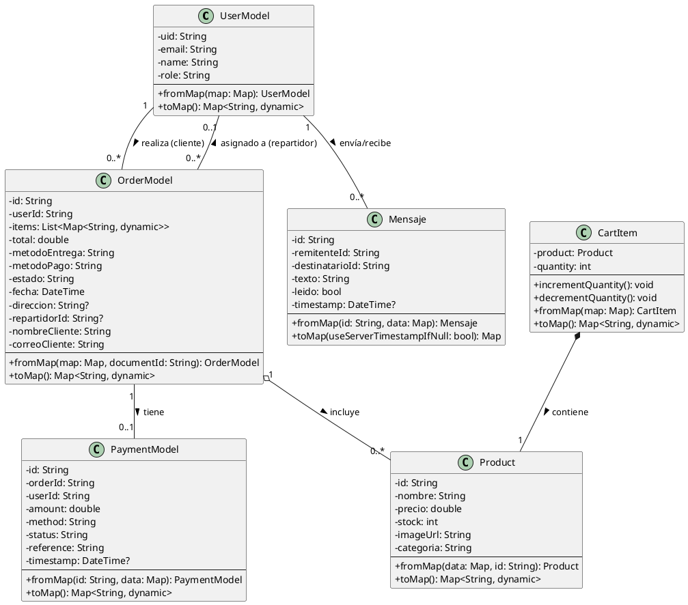

# 📐 Diagrama de Clases - Minik App

## 🎯 Descripción General

Este diagrama de clases representa las **entidades principales** del sistema **Minik App**, un sistema de e-commerce que permite a los clientes realizar compras de productos, gestionar pedidos, realizar pagos y comunicarse con el administrador.

---

## 📊 Diagrama de Clases (PlantUML)



---

## 📋 Explicación del Diagrama

### **¿Qué es un Diagrama de Clases?**
Es una representación visual de las **entidades principales** de tu sistema y cómo se relacionan entre sí. Muestra:
- **Clases**: Las "cosas" importantes de tu sistema (Usuario, Producto, Pedido, etc.)
- **Atributos**: Los datos que guarda cada clase (nombre, precio, stock, etc.)
- **Métodos**: Las acciones que puede hacer cada clase (guardar, leer desde Firebase, etc.)
- **Relaciones**: Cómo se conectan las clases entre sí

---

### **Entidades del Sistema E-commerce**

#### **👤 UserModel (Usuario)**
**Archivo:** `lib/models/user_models.dart`

Representa a los usuarios del sistema con diferentes roles.

**Roles disponibles:**
- `cliente`: Realiza compras desde la app móvil
- `admin`: Gestiona el sistema desde el panel web
- `repartidor`: Entrega pedidos desde la app móvil

**¿Por qué NO hay una clase "Repartidor" separada?**
Porque el repartidor es simplemente un `UserModel` con `role = "repartidor"`. No tiene atributos adicionales diferentes a un usuario normal, solo se diferencia por su rol.

**Relaciones:**
- Un usuario (cliente) puede realizar múltiples pedidos (1 → muchos)
- Un usuario (repartidor) puede tener múltiples pedidos asignados (1 → muchos)
- Un usuario puede enviar/recibir múltiples mensajes (1 → muchos)

---

#### **🛍️ Product (Producto)**
**Archivo:** `lib/models/product_model.dart`

Representa los productos del catálogo disponibles para la venta.

**Atributos principales:**
- `stock`: Cantidad disponible (se actualiza en tiempo real al confirmar pedidos)
- `categoria`: Permite filtrado (Lácteos, Dulces, Bebidas, etc.)
- `precio`: Precio unitario del producto

**Relaciones:**
- Los productos se incluyen en pedidos (OrderModel)
- Los productos se agregan al carrito (CartItem)

---

#### **🛒 CartItem (Item del Carrito)**
**Archivo:** `lib/models/cart_model.dart`

**¿Por qué existe CartItem?**
Cuando un cliente agrega un producto al carrito, necesita guardar:
1. **Qué producto** seleccionó (Product)
2. **Cuántas unidades** quiere comprar (quantity)

Por eso existe `CartItem`: es la combinación de un `Product` + su `quantity`.

**Ejemplo:**
```
Cliente agrega "Leche Gloria" al carrito:
- product: Product(id: "123", nombre: "Leche Gloria", precio: 5.50, ...)
- quantity: 3  (quiere comprar 3 unidades)
```

**Métodos importantes:**
- `incrementQuantity()`: Aumenta la cantidad (3 → 4)
- `decrementQuantity()`: Disminuye la cantidad (3 → 2)

**Relación COMPOSICIÓN con Product:**
- CartItem **contiene** un Product
- Si no hay Product, no puede existir CartItem
- Símbolo: `*--` (rombo negro = composición fuerte)

---

#### **📦 OrderModel (Pedido)**
**Archivo:** `lib/models/order_model.dart` (Flutter) y `admin_panel_web/src/models/Order.js` (Web)

**Entidad central del sistema.** Representa una orden de compra completa.

**Estados del pedido:**
- `Pendiente`: Recién creado, esperando procesamiento
- `En camino`: Asignado a repartidor y en ruta de entrega
- `Entregado`: Completado exitosamente
- `Pagado`: Pago confirmado

**Métodos de entrega:**
- `delivery`: Entrega a domicilio (requiere dirección)
- `recojo en tienda`: Cliente recoge en local

**Métodos de pago:**
- Contra entrega, Yape, BCP, MercadoPago

**Atributos importantes:**
- `userId`: ID del cliente que realizó el pedido
- `repartidorId`: ID del repartidor asignado (opcional, puede ser null)
- `nombreCliente` y `correoCliente`: Datos del cliente

**Relaciones:**
- Pertenece a un `UserModel` (cliente) mediante `userId`
- Puede estar asignado a un `UserModel` (repartidor) mediante `repartidorId`
- Incluye múltiples `Product` (guardados en `items` como lista)
- Tiene asociado un `PaymentModel` (opcional: 0..1)

---

#### **💳 PaymentModel (Pago)**
**Archivo:** `lib/models/payment_model.dart`

Representa una transacción de pago asociada a un pedido.

**Estados del pago:**
- `pending`: Esperando confirmación
- `completed`: Pago exitoso
- `failed`: Pago fallido

**Atributos clave:**
- `reference`: Referencia única de la transacción
- `method`: Método de pago utilizado
- `amount`: Monto total pagado
- `orderId`: ID del pedido al que pertenece

**Relación:**
- Un pago está asociado a un único pedido (OrderModel)

---

#### **💬 Mensaje**
**Archivo:** `lib/models/mensaje_model.dart`

Representa un mensaje en el sistema de chat directo entre cliente y administrador.

**Características:**
- Comunicación bidireccional en tiempo real
- Atributo `leido` para gestionar mensajes no leídos
- Timestamp para ordenamiento cronológico

**Relación:**
- Los usuarios (UserModel) envían y reciben mensajes entre sí

---

## 🔗 Tipos de Relaciones (¿Cómo se conectan las clases?)

### **1. Composición (◆—) - Símbolo: `*--`**
**Definición:** Una clase **contiene** a otra y no puede existir sin ella.

**En tu proyecto:**
- `CartItem *-- Product`
  - **Significado:** CartItem contiene un Product
  - **Ejemplo:** Si tienes un item en el carrito, DEBE tener un producto asociado
  - **Código real:**
  ```dart
  class CartItem {
    final Product product;  // ← Composición: CartItem NECESITA un Product
    int quantity;
  }
  ```

---

### **2. Agregación (◇—) - Símbolo: `o--`**
**Definición:** Una clase **incluye** a otra, pero ambas pueden existir independientemente.

**En tu proyecto:**
- `OrderModel o-- Product`
  - **Significado:** Un pedido incluye productos
  - **Ejemplo:** Un pedido tiene una lista de productos, pero los productos existen independientemente
  - **Código real:**
  ```dart
  class OrderModel {
    final List<Map<String, dynamic>> items;  // ← Lista de productos
  }
  ```

---

### **3. Asociación (—) - Símbolo: `--`**
**Definición:** Una clase está **relacionada** con otra mediante un ID o referencia.

**En tu proyecto:**

#### **a) UserModel "1" -- "0..*" OrderModel : realiza**
- **Significado:** Un usuario puede realizar múltiples pedidos (0 o más)
- **Código real:**
```dart
class OrderModel {
  final String userId;  // ← Referencia al usuario que hizo el pedido
}
```

#### **b) OrderModel "1" -- "0..1" PaymentModel : tiene**
- **Significado:** Un pedido puede tener 0 o 1 pago asociado
- **Código real:**
```dart
class PaymentModel {
  final String orderId;  // ← Referencia al pedido
}
```

#### **c) UserModel "1" -- "0..*" Mensaje : envía/recibe**
- **Significado:** Un usuario puede enviar/recibir múltiples mensajes
- **Código real:**
```dart
class Mensaje {
  final String remitenteId;     // ← Usuario que envía
  final String destinatarioId;  // ← Usuario que recibe
}
```

#### **d) OrderModel "0..*" -- "0..1" UserModel : asignado a (repartidor)**
- **Significado:** Un pedido puede estar asignado a un repartidor (UserModel con role="repartidor")
- **Código real:**
```dart
class OrderModel {
  final String? repartidorId;  // ← ID del repartidor (UserModel)
}
```
- **Ejemplo:** Admin asigna el pedido #123 al repartidor "Juan" (uid: "abc123")
  - `OrderModel.repartidorId = "abc123"`
  - Ese "abc123" es el `uid` de un `UserModel` con `role = "repartidor"`

---

### **❌ NO HAY HERENCIA en tu proyecto**
**Herencia** sería cuando una clase "extiende" de otra usando `extends`.

**Ejemplo de herencia (NO está en tu proyecto):**
```dart
class Animal {
  void comer() {}
}

class Perro extends Animal {  // ← Herencia
  void ladrar() {}
}
```

**En tu proyecto:** Todas las clases son **independientes**, no hay `extends`.

---

### **🚚 ¿Por qué NO hay una clase "Repartidor" separada?**

**Pregunta común:** "El repartidor también participa en el e-commerce, ¿no debería tener su propia clase?"

**Respuesta:** NO necesitas una clase separada porque:

1. **Repartidor = UserModel con role="repartidor"**
   - Tiene los mismos atributos que cualquier usuario (uid, email, name, role)
   - No necesita datos adicionales (como licencia, vehículo, etc.)

2. **Se identifica solo por su rol**
   ```dart
   UserModel repartidor = UserModel(
     uid: "abc123",
     email: "juan@repartidor.com",
     name: "Juan Pérez",
     role: "repartidor"  // ← Solo esto lo diferencia
   );
   ```

3. **La relación con OrderModel usa el mismo UserModel**
   - `OrderModel.userId` → Cliente (UserModel con role="cliente")
   - `OrderModel.repartidorId` → Repartidor (UserModel con role="repartidor")

**Si tuvieras una clase Repartidor separada, sería así (pero NO es necesario):**
```dart
// ❌ NO necesitas esto en tu proyecto
class Repartidor extends UserModel {
  String? licencia;
  String? vehiculo;
  // ... más atributos específicos
}
```

**Conclusión:** Tu diseño es correcto y eficiente. Usas **un solo modelo (UserModel)** con diferentes **roles** para diferenciar tipos de usuarios.

---

## 🔄 Flujo Principal del E-commerce (con Repartidor)

```
1. Cliente (UserModel role="cliente") navega productos (Product)
2. Agrega productos al carrito (CartItem)
3. Confirma compra → Crea pedido (OrderModel con userId del cliente)
4. Selecciona método de pago y entrega
5. Realiza pago (PaymentModel)
6. Admin asigna repartidor:
   - Busca un UserModel con role="repartidor"
   - Actualiza OrderModel.repartidorId con el uid del repartidor
7. Repartidor (UserModel role="repartidor") ve sus pedidos asignados
8. Repartidor actualiza estado del pedido (En camino → Entregado)
9. Cliente recibe notificación de entrega
```

**Relaciones en el flujo:**
- `OrderModel.userId` = uid del **cliente** (UserModel)
- `OrderModel.repartidorId` = uid del **repartidor** (UserModel)
- Ambos son el mismo tipo de clase (UserModel), solo difieren en el atributo `role`

---

## 🎯 Características del Sistema

- **Gestión de stock en tiempo real**: El stock se actualiza automáticamente al confirmar pedidos
- **Múltiples métodos de pago**: Contra entrega, Yape, BCP, MercadoPago
- **Sistema de roles**: Cliente, Admin, Repartidor
- **Chat directo**: Comunicación entre cliente y administrador
- **Seguimiento de pedidos**: Estados actualizables en tiempo real
- **Persistencia de datos**: Firebase Firestore para sincronización en tiempo real

---

## 📝 Resumen Final

### **6 Entidades Principales:**
1. **UserModel** - Usuarios con roles (cliente/admin/repartidor)
2. **Product** - Productos del catálogo con stock
3. **CartItem** - Items del carrito (producto + cantidad)
4. **OrderModel** - Pedidos con estados y métodos de pago/entrega
5. **PaymentModel** - Transacciones de pago
6. **Mensaje** - Chat directo cliente-admin

### **3 Tipos de Relaciones:**
1. **Composición** (`*--`): CartItem contiene Product
2. **Agregación** (`o--`): OrderModel incluye Products
3. **Asociación** (`--`): 
   - UserModel (cliente) ↔ OrderModel (realiza pedidos)
   - UserModel (repartidor) ↔ OrderModel (entrega pedidos)
   - OrderModel ↔ PaymentModel
   - UserModel ↔ Mensaje

### **❌ NO hay herencia** en el proyecto (ninguna clase usa `extends`)

### **🚚 Repartidor:**
- **NO es una clase separada**
- Es un `UserModel` con `role = "repartidor"`
- Se relaciona con `OrderModel` mediante el campo `repartidorId`
- Participa en el e-commerce como entregador de pedidos

### **✅ Todos los archivos existen en tu proyecto:**
- `lib/models/user_models.dart`
- `lib/models/product_model.dart`
- `lib/models/cart_model.dart`
- `lib/models/order_model.dart`
- `lib/models/payment_model.dart`
- `lib/models/mensaje_model.dart`

---

**Generado para:** Minik App - Sistema de E-commerce  
**Fecha:** Octubre 2025  
**Tecnologías:** Flutter (App Móvil) + React (Panel Web) + Firebase (Backend)
