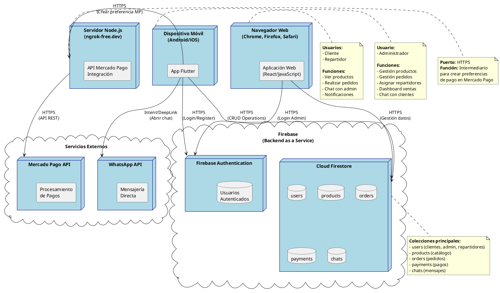

# 🚀 Diagrama de Despliegue - Minik App

## 🎯 Descripción General

Este diagrama representa la **arquitectura de despliegue** del sistema **Minik App**, mostrando cómo se distribuyen los componentes del sistema en diferentes **nodos físicos** (dispositivos, servidores, servicios en la nube) y cómo se comunican entre sí a través de la red.

---

## 📊 Diagrama de Despliegue (PlantUML)



---

## 📋 Explicación del Diagrama

### **🎯 ¿Qué es un Diagrama de Despliegue?**

Es un diagrama UML que muestra:
- **Nodos físicos** (dispositivos, servidores, servicios en la nube)
- **Componentes de software** desplegados en cada nodo
- **Conexiones de red** entre los nodos (protocolos de comunicación)
- **Infraestructura física** del sistema

Representa **dónde se ejecuta cada parte del sistema** y **cómo se comunican** a través de la red.

---

## 🖥️ Nodos del Sistema

### **1. Dispositivo Móvil (Android/iOS)**

**Tipo:** Nodo cliente (dispositivo físico)

**Componente desplegado:**
- **App Flutter** - Aplicación móvil compilada

**Usuarios:**
- Cliente (compra productos)
- Repartidor (entrega pedidos)

**Funcionalidades:**
- Ver catálogo de productos
- Realizar pedidos
- Procesar pagos
- Chat con administrador
- Notificaciones en tiempo real
- Vista de repartidor

**Requisitos del dispositivo:**
- Android 5.0+ (API 21+) o iOS 11.0+
- Conexión a Internet (WiFi o datos móviles)
- 100 MB de espacio disponible
- Cámara (para escanear QR de Yape)

**Plataformas soportadas:**
- Android (APK)
- iOS (IPA)

---

### **2. Navegador Web (Chrome, Firefox, Safari)**

**Tipo:** Nodo cliente (navegador web)

**Componente desplegado:**
- **Aplicación Web React** - SPA (Single Page Application)

**Usuario:**
- Administrador (gestiona el sistema)

**Funcionalidades:**
- Dashboard con métricas
- Gestión de productos (CRUD)
- Gestión de pedidos
- Asignar repartidores
- Chat con clientes
- Reportes y gráficos
- Exportación a CSV

**Requisitos del navegador:**
- Chrome 90+, Firefox 88+, Safari 14+, Edge 90+
- JavaScript habilitado
- Conexión a Internet

**URL de acceso:**
- Desplegado en Firebase Hosting
- Ejemplo: `https://minik-app.web.app`

---

### **3. Servidor Node.js (ngrok-free.dev)**

**Tipo:** Nodo servidor (servidor de aplicaciones)

**Componente desplegado:**
- **API Mercado Pago Integración** - Servidor Express.js

**Función:**
- Intermediario entre la app móvil y Mercado Pago API
- Crea preferencias de pago en Mercado Pago
- Maneja webhooks de notificaciones de pago

**Tecnologías:**
- Node.js 18+
- Express.js
- Mercado Pago SDK

**Endpoint principal:**
```
POST https://somnambulistic-twitchingly-becki.ngrok-free.dev/create_preference
```

**Request:**
```json
{
  "title": "Pedido Minik App",
  "quantity": 1,
  "unit_price": 25.50
}
```

**Response:**
```json
{
  "id": "preference_id_123",
  "init_point": "https://www.mercadopago.com.pe/checkout/v1/redirect?pref_id=...",
  "sandbox_init_point": "https://sandbox.mercadopago.com.pe/checkout/v1/redirect?pref_id=..."
}
```

**Características:**
- Túnel ngrok para desarrollo/testing
- Puerto: 3000 (local) → HTTPS (ngrok)
- Sandbox de Mercado Pago (ambiente de pruebas)

**Nota:** En producción, este servidor debería estar en un servicio cloud como Heroku, Railway, o Google Cloud Run.

---

### **4. Firebase (Backend as a Service)**

**Tipo:** Nodo cloud (infraestructura en la nube)

Firebase es un **BaaS (Backend as a Service)** de Google que proporciona múltiples servicios:

#### **4.1 Firebase Authentication**

**Función:** Gestión de autenticación y autorización

**Características:**
- Autenticación con email/password
- Tokens JWT para sesiones
- Gestión de roles (cliente, admin, repartidor)

**Usuarios almacenados:**
- Credenciales encriptadas
- Información de perfil básica

**Protocolo:** HTTPS (REST API + SDK)

---

#### **4.2 Cloud Firestore**

**Función:** Base de datos NoSQL en tiempo real

**Colecciones:**
1. **users** - Usuarios con roles
2. **products** - Catálogo de productos
3. **orders** - Pedidos realizados
4. **payments** - Pagos procesados
5. **chats** - Mensajes del chat

**Características:**
- Sincronización en tiempo real (Firestore Streams)
- Consultas complejas con índices
- Transacciones atómicas
- Escalabilidad automática

**Protocolo:** HTTPS (gRPC + REST API)

**Región:** us-central1 (Iowa, USA)

**Nota sobre imágenes:**
- Las imágenes de productos se almacenan como **URLs externas** (links de internet)
- No se usa Firebase Storage en este proyecto
- Campo `imageUrl` en la colección `products` contiene la URL completa
- Ejemplo: `"https://example.com/producto.jpg"`

---

### **5. Servicios Externos**

#### **5.1 Mercado Pago API**

**Tipo:** Servicio externo (pasarela de pagos)

**Función:** Procesamiento de pagos con tarjeta

**Características:**
- Checkout Pro (redirección a página de pago)
- Sandbox para testing
- Webhooks para notificaciones

**Endpoint:**
```
https://api.mercadopago.com/checkout/preferences
```

**Métodos de pago soportados:**
- Tarjetas de crédito/débito
- Yape (a través de Mercado Pago)
- Transferencias bancarias

**Protocolo:** HTTPS (REST API)

**Documentación:** https://www.mercadopago.com.pe/developers

---

#### **5.2 WhatsApp**

**Tipo:** Servicio externo (mensajería)

**Función:** Envío manual de comprobantes de pago

**Características:**
- URL Scheme: `https://wa.me/51935964167`
- Intent en Android
- Deep Link en iOS

**Uso en la app:**
```dart
final whatsappUrl = 'https://wa.me/51935964167?text=Hola, adjunto comprobante de pago';
await launchUrl(Uri.parse(whatsappUrl));
```

**Protocolo:** Intent/Deep Link (abre app de WhatsApp)

**Nota:** No hay integración API, es un enlace directo.

---

## 🔌 Protocolos de Comunicación

### **1. HTTPS (HyperText Transfer Protocol Secure)**

**Usado en:**
- App Flutter ↔ Firebase
- Web App ↔ Firebase
- App Flutter ↔ Servidor Node.js
- Servidor Node.js ↔ Mercado Pago API

**Características:**
- Encriptación SSL/TLS
- Puerto 443
- Autenticación con tokens JWT

**Ejemplo de request:**
```http
POST https://firestore.googleapis.com/v1/projects/minik-app/databases/(default)/documents/orders
Authorization: Bearer <JWT_TOKEN>
Content-Type: application/json

{
  "fields": {
    "userId": {"stringValue": "user_001"},
    "total": {"doubleValue": 25.50}
  }
}
```

---

### **2. Intent/Deep Link**

**Usado en:**
- App Flutter ↔ WhatsApp

**Características:**
- Abre aplicación externa desde la app
- No requiere API
- Funciona offline (si WhatsApp está instalado)

**Android (Intent):**
```dart
final intent = AndroidIntent(
  action: 'android.intent.action.VIEW',
  data: 'https://wa.me/51935964167',
);
await intent.launch();
```

**iOS (Deep Link):**
```dart
await launchUrl(Uri.parse('https://wa.me/51935964167'));
```

---

### **3. Firestore Streams (gRPC)**

**Usado en:**
- App Flutter ↔ Cloud Firestore (notificaciones en tiempo real)
- Web App ↔ Cloud Firestore (notificaciones en tiempo real)

**Características:**
- Protocolo gRPC sobre HTTP/2
- Bidireccional (servidor puede enviar datos al cliente)
- Baja latencia
- Reconexión automática

**Ejemplo:**
```dart
FirebaseFirestore.instance
  .collection('orders')
  .where('userId', isEqualTo: currentUserId)
  .snapshots() // Stream en tiempo real
  .listen((snapshot) {
    // Se ejecuta cada vez que hay cambios
    print('Pedidos actualizados: ${snapshot.docs.length}');
  });
```

---

## 🌐 Flujo de Despliegue

### **1. Despliegue de App Móvil Flutter**

```
Código Flutter → Build APK/IPA → Distribución
```

**Pasos:**
1. Desarrollo en Flutter (Dart)
2. Compilación:
   - Android: `flutter build apk --release`
   - iOS: `flutter build ios --release`
3. Distribución:
   - Android: Google Play Store o APK directo
   - iOS: Apple App Store

**Resultado:**
- APK instalable en dispositivos Android
- IPA instalable en dispositivos iOS

---

### **2. Despliegue de Panel Web React**

```
Código React → Build producción → Firebase Hosting
```

**Pasos:**
1. Desarrollo en React (JavaScript)
2. Build de producción: `npm run build`
3. Despliegue en Firebase Hosting: `firebase deploy --only hosting`

**Resultado:**
- Aplicación web accesible desde cualquier navegador
- URL: `https://minik-app.web.app`
- CDN global de Firebase para carga rápida

---

### **3. Despliegue de Servidor Node.js**

```
Código Node.js → Servidor local → Túnel ngrok
```

**Pasos:**
1. Desarrollo en Node.js (Express)
2. Instalación de dependencias: `npm install`
3. Ejecución local: `node server.js` (puerto 3000)
4. Túnel ngrok: `ngrok http 3000`

**Resultado:**
- Servidor accesible públicamente vía HTTPS
- URL: `https://somnambulistic-twitchingly-becki.ngrok-free.dev`

**Nota:** En producción, desplegar en Heroku, Railway, o Google Cloud Run.

---

### **4. Configuración de Firebase**

```
Proyecto Firebase → Configuración → Integración con apps
```

**Pasos:**
1. Crear proyecto en Firebase Console
2. Habilitar servicios:
   - Authentication (Email/Password)
   - Cloud Firestore
   - Firebase Hosting (para panel web)
3. Configurar reglas de seguridad
4. Obtener credenciales:
   - Android: `google-services.json`
   - iOS: `GoogleService-Info.plist`
   - Web: Firebase config object

**Resultado:**
- Backend completamente funcional sin servidor propio
- Escalabilidad automática
- Sincronización en tiempo real

---

## 📊 Tabla Resumen de Nodos

| Nodo | Tipo | Componente | Tecnología | Protocolo | Usuarios |
|------|------|------------|------------|-----------|----------|
| **Dispositivo Móvil** | Cliente | App Flutter | Flutter 3.9.2 | HTTPS | Cliente, Repartidor |
| **Navegador Web** | Cliente | Web React | React 19.1.1 | HTTPS | Administrador |
| **Servidor Node.js** | Servidor | API MP | Node.js + Express | HTTPS | - |
| **Firebase Auth** | Cloud | Autenticación | Firebase | HTTPS | Todos |
| **Cloud Firestore** | Cloud | Base de datos | Firestore | HTTPS + gRPC | Todos |
| **Mercado Pago** | Externo | Pagos | API REST | HTTPS | - |
| **WhatsApp** | Externo | Mensajería | URL Scheme | Intent/Deep Link | - |

**Nota:** Las imágenes de productos se almacenan como URLs externas, no se usa Firebase Storage.

---

## 🔐 Seguridad en el Despliegue

### **1. Comunicación Encriptada**
- ✅ Todas las comunicaciones usan **HTTPS** (SSL/TLS)
- ✅ Certificados válidos en todos los servicios
- ✅ No hay comunicación HTTP sin encriptar

### **2. Autenticación**
- ✅ Firebase Authentication con tokens JWT
- ✅ Tokens renovables automáticamente
- ✅ Expiración de sesiones después de 1 hora

### **3. Autorización**
- ✅ Firestore Security Rules basadas en roles
- ✅ Validación de permisos en cada operación
- ✅ Usuarios solo acceden a sus propios datos

### **4. Protección de APIs**
- ✅ Servidor Node.js valida requests
- ✅ CORS configurado correctamente
- ✅ Rate limiting para evitar abuso

### **5. Datos Sensibles**
- ✅ Contraseñas hasheadas por Firebase Auth
- ✅ Tokens de pago no se almacenan
- ✅ Información de tarjetas manejada por Mercado Pago

---

## 🚀 Escalabilidad

### **Firebase (Backend)**
- ✅ **Escalabilidad automática** - Firebase escala según demanda
- ✅ **Sin límite de usuarios** - Soporta millones de usuarios
- ✅ **CDN global** - Baja latencia en todo el mundo

### **App Móvil**
- ✅ **Distribución escalable** - Play Store y App Store
- ✅ **Actualizaciones OTA** - Sin reinstalar la app

### **Panel Web**
- ✅ **Firebase Hosting** - CDN global automático
- ✅ **Carga rápida** - Archivos estáticos optimizados

### **Servidor Node.js**
- ⚠️ **Limitación actual** - ngrok es para desarrollo
- ✅ **Solución producción** - Desplegar en cloud con auto-scaling

---

## 💡 Para tu Sustentación

### **Puntos clave a mencionar:**

1. **Arquitectura distribuida** - 3 tipos de nodos: cliente, servidor, cloud
2. **2 frontends** - App móvil (Flutter) y Panel web (React)
3. **Backend en la nube** - Firebase BaaS (sin servidor propio)
4. **Servidor intermedio** - Node.js para integración con Mercado Pago
5. **Servicios externos** - Mercado Pago y WhatsApp
6. **Comunicación segura** - Todo por HTTPS
7. **Tiempo real** - Firestore Streams para notificaciones

### **Cómo explicarlo:**

> "El diagrama de despliegue muestra cómo se distribuye el sistema Minik App en diferentes nodos físicos. Tenemos dos tipos de clientes: dispositivos móviles con la app Flutter para clientes y repartidores, y navegadores web con la aplicación React para administradores. El backend está en Firebase, que es un Backend as a Service de Google que incluye autenticación y base de datos Firestore. Todos se comunican por HTTPS de forma segura. Las imágenes de productos se almacenan como URLs externas, no usamos Firebase Storage. Además, tenemos un servidor Node.js con ngrok que actúa como intermediario para crear preferencias de pago en Mercado Pago, porque necesitamos proteger las credenciales de la API. La app también se integra con WhatsApp mediante URL Scheme para enviar comprobantes de pago manualmente. Firebase maneja la escalabilidad automáticamente y proporciona sincronización en tiempo real mediante Firestore Streams."

### **Si te preguntan por ngrok:**

> "Ngrok es un túnel que expone nuestro servidor local a Internet con HTTPS. Lo usamos para desarrollo y testing porque Mercado Pago requiere un endpoint público para crear preferencias de pago. En producción, este servidor debería estar desplegado en un servicio cloud como Heroku, Railway o Google Cloud Run con un dominio propio y certificado SSL permanente. Ngrok es temporal y se reinicia cada vez que se ejecuta, por eso es solo para desarrollo."

### **Si te preguntan por Firebase:**

> "Elegimos Firebase porque es un Backend as a Service que nos ahorra crear y mantener un servidor backend propio. Incluye autenticación, base de datos NoSQL con sincronización en tiempo real y hosting para el panel web, todo integrado. Escala automáticamente según la demanda, tiene un plan gratuito generoso para proyectos pequeños, y se integra perfectamente con Flutter y React mediante SDKs oficiales. Esto reduce significativamente el tiempo de desarrollo y los costos de infraestructura. Para las imágenes de productos usamos URLs externas en lugar de Firebase Storage para simplificar el sistema."

---

## 📈 Ventajas de esta Arquitectura

### **✅ Ventajas:**

1. **Bajo costo** - Firebase tiene plan gratuito generoso
2. **Escalabilidad automática** - No requiere configuración
3. **Tiempo real** - Firestore Streams sin WebSockets manuales
4. **Seguridad** - Firebase maneja autenticación y autorización
5. **Mantenimiento mínimo** - Google gestiona la infraestructura
6. **Multiplataforma** - Una base de código para Android e iOS
7. **Desarrollo rápido** - SDKs oficiales para Flutter y React

### **⚠️ Limitaciones:**

1. **Vendor lock-in** - Dependencia de Firebase/Google
2. **Costos en escala** - Puede ser caro con muchos usuarios
3. **Servidor Node.js temporal** - ngrok no es para producción
4. **Sin control total** - Firebase maneja la infraestructura

---

**Generado para:** Minik App - Sistema de E-commerce  
**Fecha:** Noviembre 2025  
**Tecnologías:** Flutter + React + Firebase + Node.js + ngrok
