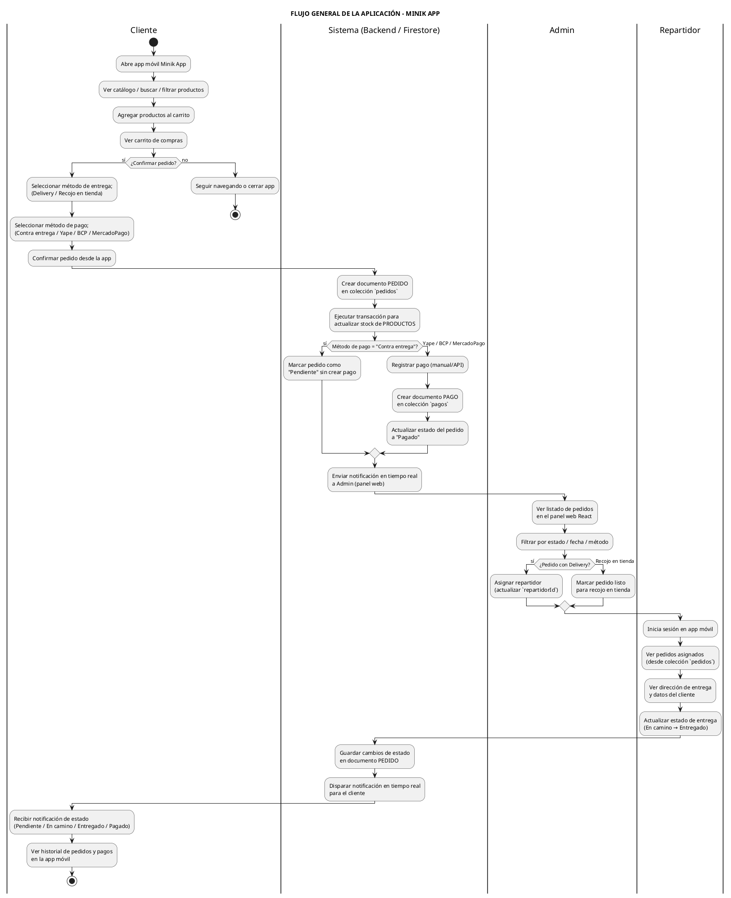

# 🔄 Diagrama de Flujo General de la Aplicación - Minik App

## 🎯 Descripción General

Este documento muestra el **flujo lógico completo** de la aplicación **Minik App** desde la perspectiva de los tres actores principales:

- **Cliente** (app móvil Flutter)
- **Administrador** (panel web React)
- **Repartidor** (app móvil Flutter)

El diagrama resume **cómo fluye la información** entre la app, el panel web y la base de datos **NoSQL (Firestore)** durante el proceso de compra, pago, entrega y notificaciones.

---

## 📊 Diagrama de Flujo General (PlantUML)

---

## 📋 Explicación del Flujo

### 1️⃣ Cliente (App Móvil)

- **Navega productos**: Ve catálogo, busca y filtra por categoría.
- **Arma el carrito**: Agrega productos y revisa el resumen.
- **Confirma el pedido**: Elige método de entrega y de pago.

### 2️⃣ Sistema / Firestore

- **Crea el pedido** en la colección `pedidos` con:
  - Datos del cliente
  - Lista de ítems (`items[]`)
  - Total, método de pago y entrega
  - Estado inicial (`Pendiente` o `Pagado` según el caso)
- **Actualiza el stock** de `productos` usando una transacción atómica.
- **Registra el pago** en la colección `pagos` cuando el método no es contra entrega.
- **Dispara notificaciones en tiempo real** para Admin y Cliente (Streams de Firestore).

### 3️⃣ Administrador (Panel Web React)

- Visualiza todos los pedidos con filtros por:
  - Estado (Pendiente, En camino, Entregado, Pagado)
  - Fecha
  - Método de pago / entrega
- Para pedidos con **Delivery**:
  - Asigna un repartidor (`repartidorId`).
- Para pedidos con **Recojo en tienda**:
  - Marca el pedido como listo para recojo.

### 4️⃣ Repartidor (App Móvil)

- Inicia sesión con su usuario (`role = "repartidor"`).
- Ve los pedidos asignados usando el campo `repartidorId`.
- Consulta la dirección del cliente y el detalle del pedido.
- Actualiza el estado de entrega: `En camino` → `Entregado`.

### 5️⃣ Notificaciones y Seguimiento

- Cada cambio de estado en `pedidos` se refleja en tiempo real en la app del cliente.
- El cliente puede:
  - Ver el **historial de pedidos**.
  - Ver el **historial de pagos** (colección `pagos`).
  - Descargar la **boleta/factura en PDF** cuando aplique.

---

## 💡 Para tu Sustentación

- **Nombre del diagrama:** Diagrama de Flujo General / Diagrama de Actividad de la Aplicación.
- **Propósito:** Mostrar cómo interactúan **Cliente, Admin, Repartidor y Firestore** en el flujo completo del e-commerce.
- **Relación con otros diagramas:**
  - Se apoya en los **casos de uso** (qué puede hacer cada actor).
  - Se basa en el **diagrama de base de datos** (colecciones `productos`, `users`, `pedidos`, `pagos`, `mensajes`).
  - Complementa el **diagrama de clases** (modelos `UserModel`, `OrderModel`, `PaymentModel`, etc.).

### Frase que puedes usar al explicar

> "Este es el diagrama de flujo general de Minik App. Muestra el recorrido completo desde que el cliente abre la app, ve productos, arma el carrito y confirma el pedido, hasta que el sistema crea el pedido en Firestore, registra el pago, el administrador lo gestiona desde el panel web y el repartidor realiza la entrega. Cada cambio de estado se refleja en tiempo real en la app del cliente gracias a Firestore. Este diagrama conecta los actores (Cliente, Admin, Repartidor) con la base de datos NoSQL y los procesos principales del e-commerce."
